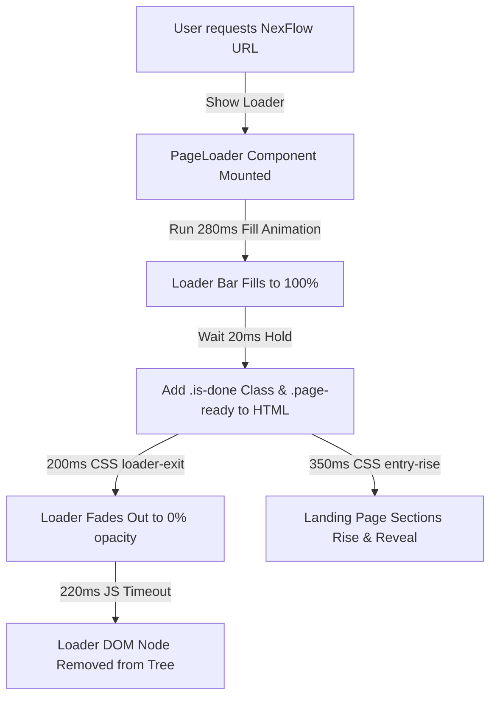
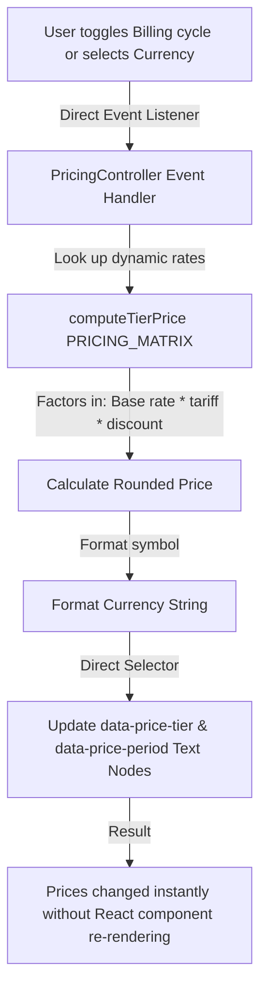
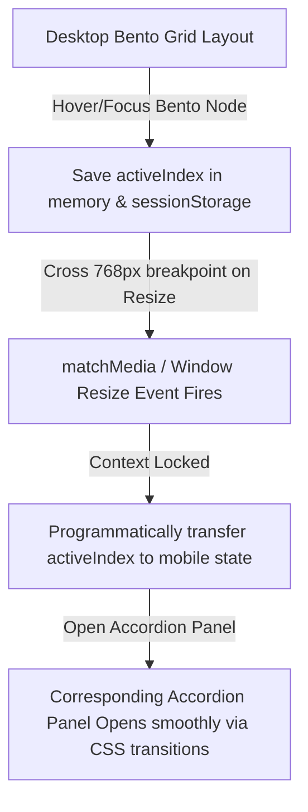

# NexFlow — AI-Driven Data Automation Platform

[](https://nextjs.org)
[](https://tailwindcss.com)
[](https://www.typescriptlang.org)
[](https://opensource.org/licenses/MIT)

**NexFlow** is a premium, high-converting, and performance-isolated SaaS landing page built for the **Next-Gen AI Platform Speed Run**. The application features advanced pricing algorithms, responsive layout transition mechanisms, and custom zero-dependency CSS motion sequences.

---

## 🛠️ Tech Stack & Key Choices

| Technology | Purpose | Rationale |
| :--- | :--- | :--- |
| **Next.js 16** | Core Framework | App Router & React Server Components enable zero-JS execution of page outlines and maximum SEO indexing. |
| **Tailwind CSS v4** | Styling | Utility-first CSS using hardware-accelerated transitions. Offers high fidelity with a footprint optimized for speed. |
| **React 19** | UI Library | Modern component model, optimized hydration, and unified server-client data delivery. |
| **TypeScript** | Language | Full static typing of the dynamic pricing matrix and feature showcase states to ensure codebase resilience. |
| **Google Fonts** | Typography | High-contrast combination of **Inter** (UI elements) and **JetBrains Mono** (Technical headings). |

---

## 🗺️ Code Structure & Folder Organization

```bash
landing/
├── public/                 # Static assets (favicons, generic assets)
├── src/
│   ├── app/
│   │   ├── globals.css     # Global stylesheets and design tokens (variables)
│   │   ├── layout.tsx      # Root HTML wrapper, metadata/SEO configuration
│   │   └── page.tsx        # Main page assembler (Server Components integration)
│   ├── components/
│   │   ├── FeatureShowcase.tsx       # Responsive Bento Grid / Mobile Accordion Showcase
│   │   ├── HeroSection.tsx           # Main Hero area with responsive mock dashboard
│   │   ├── PageLoader.tsx            # Initial pre-loader component (≤500ms exit lifecycle)
│   │   ├── PricingControllerMount.tsx# Client mount component for pricing DOM events
│   │   ├── PricingSection.tsx        # Pricing tier matrix renderer
│   │   ├── SiteFooter.tsx            # Layout Footer
│   │   ├── SiteHeader.tsx            # Sticky, backdrop-blurred navigation header
│   │   ├── SocialProofSection.tsx    # Testimonial marquee container
│   │   └── StructuredData.tsx        # JSON-LD Schema injector for SEO hygiene
│   └── lib/
│       ├── featureContext.ts         # Global index trackers & viewport calculations
│       ├── pricingController.ts      # Pure DOM-based Pricing and Currency state manager
│       └── pricingMatrix.ts          # Price calculation rules & currency conversion formulas
├── eslint.config.mjs       # Static analysis guidelines
├── package.json            # Scripts and dependencies configurations
└── tsconfig.json           # Compiler rules for TypeScript
```

---

## 🔄 Workflow & Execution Flow Diagrams

### 1. Initial Page Loading & Entry Performance Flow (≤500ms Cap)
NexFlow implements a strict 500ms preloader lifecycle. The loading bar animates instantly using CSS animations, then unmounts entirely from the DOM to ensure early TTI (Time to Interactive).



### 2. State-Isolated Pricing & Currency Switcher
To guarantee zero layout reflows and eliminate layout thrashing, changing the billing cycle or currency bypasses React's virtual DOM diffing entirely. The `PricingController` manipulates the text nodes directly.



### 3. Bento-to-Accordion Layout & Context Lock
The desktop bento grid automatically refactors to a touch-optimized accordion below 768px. If the user is hovering over node #3 on desktop, that exact index is synced so that accordion panel #3 remains open upon transition.



---

## 🚀 Setup & Installation Instructions

### Prerequisites
Ensure you have the following installed:
- [Node.js](https://nodejs.org) (v18.x or later recommended)
- [npm](https://www.npmjs.com) (v9.x or later)

### Local Configuration Steps

1. **Clone the Repository:**
   ```bash
   git clone https://github.com/ramalokeshreddyp/nextgen-ai-platform-speedrun.git
   cd nextgen-ai-platform-speedrun/landing
   ```

2. **Install Dependencies:**
   ```bash
   npm install
   ```

3. **Start the Development Server:**
   ```bash
   npm run dev
   ```
   Open your browser to [http://localhost:3000](http://localhost:3000) to view the live build locally.

4. **Verify Linter Checks:**
   ```bash
   npm run lint
   ```

5. **Generate Production Bundle:**
   ```bash
   npm run build
   ```

6. **Serve Production Build Locally:**
   ```bash
   npm run start
   ```

---

## 📈 Usage Instructions

### Toggling Billing Cycle & Currency Switcher
- Navigate to the **Pricing** section.
- Click the **Monthly** or **Annual** button. The annual selector applies a flat **20% discount** dynamically.
- Select your preferred currency (**INR, USD, EUR**) from the dropdown. 
- Open React DevTools and check the update highlights. You will notice that toggling these selectors updates **only** the text nodes containing the price strings, keeping parent components from re-rendering.

### Resizing viewport (Bento Context Lock)
- Navigate to the **Core Capabilities** section on a desktop screen.
- Hover over any item (e.g., *Auto-Scaling Infra*, index #2).
- Shrink the browser window width past **768px**.
- The layout smoothly transitions to the mobile Accordion, with the panel for *Auto-Scaling Infra* open.
- The open index is persisted inside `sessionStorage` so refreshing the browser retains the active context.
