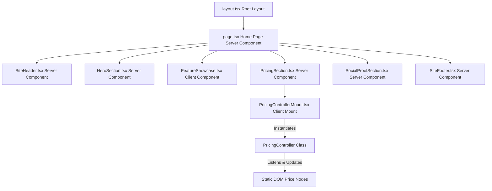
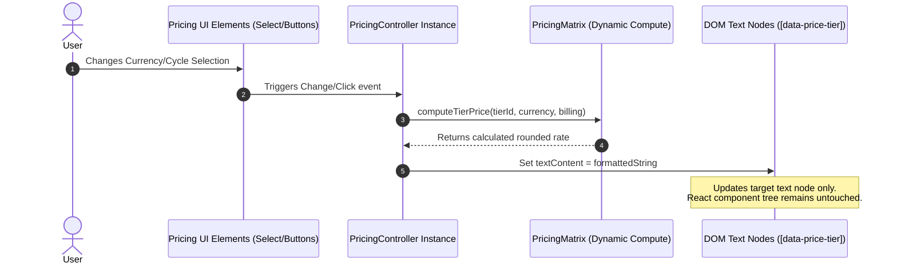
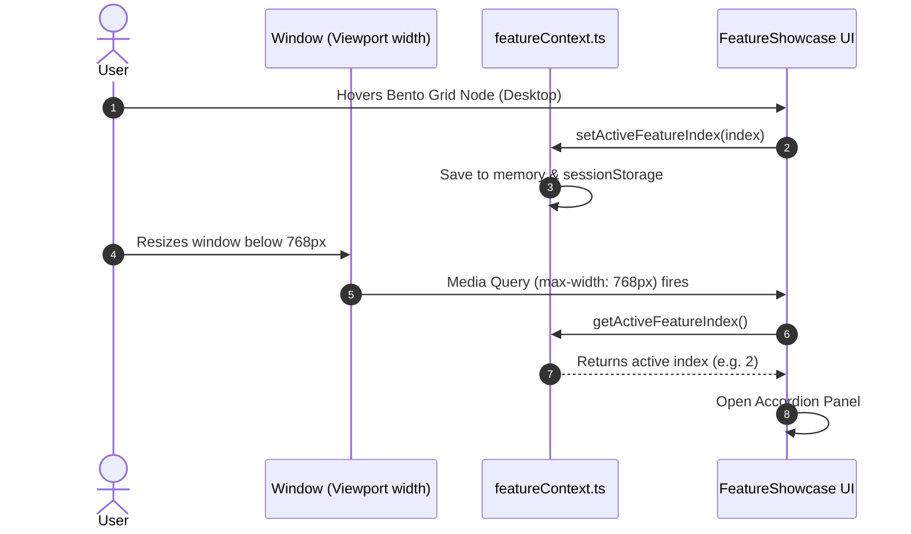

# NexFlow System Architecture & Design

This document details the architectural design, component interactions, and state management strategies of **NexFlow**.

---

## 🎯 System Overview & Objective

The primary objective of NexFlow is to deliver an **extremely fast, SEO-optimized, and highly responsive SaaS landing page** for an AI-driven data automation platform. 

The architecture is built to address three major constraints:
1. **Performance isolation:** Zero React re-renders when changing currencies or billing cycles.
2. **Context locked view transition:** Fluid refactoring of a Bento Grid (desktop) into a touch-optimized Accordion (mobile) without losing active selection state.
3. **Execution caps:** Initial page loading sequence and page elements entry orchestration must finalize within **500ms** total.

---

## 🏗️ Architectural Topology

NexFlow utilizes a hybrid component model matching **Next.js 16 (App Router)** principles combined with **Direct DOM Manipulation** for high-frequency interactive updates.



### Server Components (Zero Client-Side JS overhead)
- `SiteHeader`, `HeroSection`, `PricingSection`, `SocialProofSection`, and `SiteFooter` are rendered as React Server Components. They output pure semantic HTML and require no client-side runtime hydration, keeping TTI (Time to Interactive) extremely low.

### Client-Side Integration Nodes
- **`PricingControllerMount`:** Acts as a lightweight client-side bridge. It returns `null` (avoiding virtual DOM overhead) and instantiates the pure TypeScript `PricingController` inside a `useEffect` hook.
- **`FeatureShowcase`:** A Client Component that controls the Bento Grid hover state and Accordion transitions. It synchronizes viewport resizing using browser media queries.

---

## 📊 Component & Data Flow Details

### 1. Zero Re-render Price Updates
Updating billing or currency cycles traditionally causes parent components to re-render, creating virtual DOM diffing cycles and layout reflows. NexFlow implements a state-isolated DOM controller pattern.



### 2. Context Lock Layout Refactoring
The showcase component tracks the user's active node and programmatically coordinates the layout update during viewport resizing.



---

## 🔧 Core Modules & Responsibilities

### `pricingMatrix.ts`
- **Responsibilities:** Holds the multi-dimensional rate matrices including base currency rates, discount structures (flat 20% annual discount multiplier), and regional tariffs (e.g. EUR regional tariff coefficient of 1.05).
- **Core API:** `computeTierPrice(tierId, currency, billing)`, `formatPrice(amount, currency)`.

### `pricingController.ts`
- **Responsibilities:** Queries the pricing container DOM root, binds standard event listeners (click and change) to controllers, and updates nodes matching the `[data-price-tier]` and `[data-price-period]` selectors directly when events fire.

### `featureContext.ts`
- **Responsibilities:** Controls the active capability index state, manages storage persistence using `sessionStorage` fallback, and provides utility indicators such as `isMobileViewport()` using the standard `window.innerWidth` API.

---

## 🏁 Crucial Integrations

### CSS Grid Transition Easing
Standard height transitions (`height: auto` to `height: 0`) cannot be animated natively in CSS. NexFlow resolves this by animating `grid-template-rows` from `0fr` to `1fr` on the accordion wrapper:
```css
.accordion-panel {
  display: grid;
  grid-template-rows: 0fr;
  transition: grid-template-rows var(--duration-structural) var(--ease-structural);
}
.accordion-item.is-open .accordion-panel {
  grid-template-rows: 1fr;
}
.accordion-panel__inner {
  overflow: hidden;
}
```
This guarantees smooth, high-fps hardware-accelerated motion matching the target easing configurations:
- **Micro-interactions:** `150ms` - `200ms` using `cubic-bezier(0, 0, 0.2, 1)` (ease-out).
- **Structural layout reflows:** `300ms` - `400ms` using `cubic-bezier(0.4, 0, 0.2, 1)` (ease-in-out).
